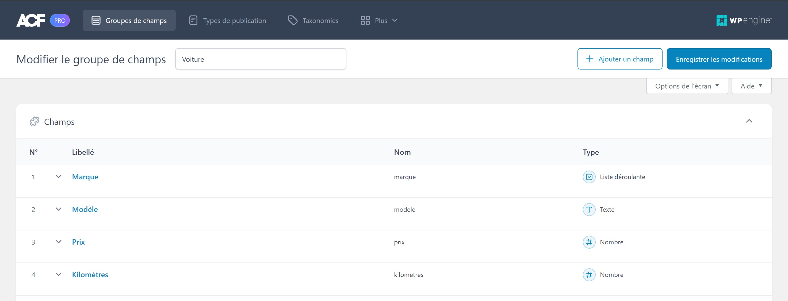
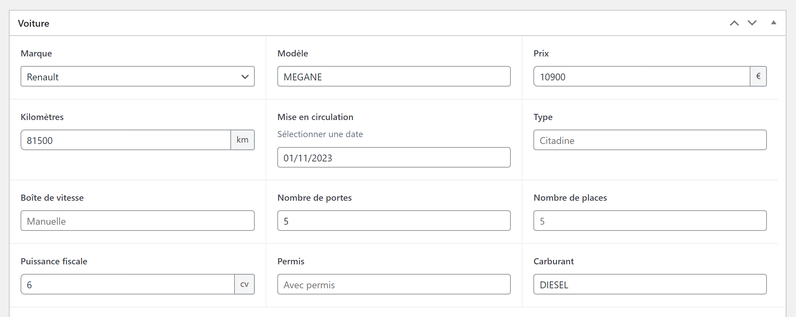

## 

**Date** : Mai 2024  
**Session** : MMI 1 2023/2024  
**Intervenant** : Florian Jourde  
**Contact** : [jourdeflorian@gmail.com](www.jourdeflorian@gmail.com)  

---

## 
<ol>
  <li><a href="#1-installation">Installation de WordPress avec Wamp</a>
    <ol>
      <li>Installation de WordPress</li>
    </ol>
  </li>
  <li><a href="#2-advantages">Les avantages de WordPress</a>
    <ol>
      <li>Gestion du contenu simplifiée</li>
      <li>Fonctionnalités intégrées</li>
      <li>Support et communauté</li>
    </ol>
  </li>
  <li><a href="#3-child-theme">Création de thèmes enfants</a>
    <ol>
      <li>Qu'est-ce qu'un thème enfant ?</li>
      <li>Création d'un thème enfant</li>
    </ol>
  </li>
  <li><a href="#4-page-creation">Création et personnalisation de pages</a>
    <ol>
      <li>Personnalisation des pages</li>
      <li>Ajout de contenu statique et dynamique aux pages</li>
    </ol>
  </li>
  <li><a href="#5-custom-pages">Création de modèles de page personnalisés</a>
    <ol>
      <li>Explication des modèles de page personnalisés</li>
      <li>Utilité des modèles de page personnalisés</li>
      <li>Création d'un modèle de page personnalisé</li>
    </ol>
  </li>
  <li><a href="#6-acf">Installation et configuration du plugin ACF</a>
    <ol>
      <li>Création de pages avec ACF</li>
      <li>Installation du plugin ACF</li>
      <li>Configuration de ACF</li>
      <li>Création de champs personnalisés</li>
      <li>Liaison des champs ACF aux pages</li>
    </ol>
  </li>
</ol>

---

<h2 id="1-installation"> 


</h2>

### 

1. Téléchargez la dernière version de WordPress depuis le site officiel.
2. Extrayez le fichier ZIP dans le répertoire www de votre installation Wamp (habituellement C:\wamp64\www).
3. Renommez le dossier extrait en un nom facile à retenir pour votre site, par exemple "mon-site".
4. Ouvrez votre navigateur et accédez à localhost/mon-site pour commencer l'installation de WordPress.

Exemple de configuration de la base de données dans WordPress (wp-config.php) :

```php
// Configuration de la base de données MySQL pour WordPress
define( 'DB_NAME', 'nom_de_la_base_de_donnees' );
define( 'DB_USER', 'nom_utilisateur' );
define( 'DB_PASSWORD', 'mot_de_passe' );
define( 'DB_HOST', 'localhost' );
```

<h2 id="2-advantages"> 


</h2>

### 

WordPress offre une interface conviviale pour gérer le contenu du site, permettant même aux utilisateurs non techniques de mettre à jour facilement le contenu des pages, des articles de blog et d'autres éléments.

Exemple d'affichage du contenu d'un article dans WordPress :

```php
<?php 
if ( have_posts() ) : 
    while ( have_posts() ) : the_post(); 
        the_content(); 
    endwhile; 
endif; 
?>
```

### 

WordPress offre de nombreuses fonctionnalités intégrées telles que la gestion des utilisateurs, la gestion des commentaires, la gestion des médias, etc., ce qui réduit le besoin de développement personnalisé pour ces fonctionnalités de base.

Exemple d'affichage du contenu de l'utilisateur connecté dans WordPress :

```php
<?php echo 'Bienvenue, ' . $current_user->user_login . '!'; ?>
```

### 

WordPress bénéficie d'une communauté active de développeurs et d'utilisateurs qui partagent des conseils, des tutoriels et des ressources, offrant un soutien précieux aux personnes travaillant avec la plateforme.

Conclusion : WordPress offre de nombreux avantages par rapport au développement "à la main" en PHP, notamment une gestion simplifiée du contenu, une grande variété de plugins et de thèmes, un développement rapide et des fonctionnalités intégrées, ce qui en fait un choix puissant pour la création de sites Web de toutes tailles et de tous types.

<h2 id="3-child-theme"> 


</h2>

**Objectif** : Comprendre l'importance et le processus de création de thèmes enfants dans WordPress, ainsi que la personnalisation de ces thèmes enfants en ajoutant des styles CSS et des fonctionnalités via le fichier functions.php.

### 

Un thème enfant est un thème WordPress qui hérite des fonctionnalités et du style d'un autre thème parent, appelé le thème parent. Cela permet de personnaliser et d'étendre les fonctionnalités d'un thème parent sans modifier directement ses fichiers.

Il est important d'utiliser un thème enfant pour plusieurs raisons : cela facilite la maintenance en isolant les modifications du thème parent, cela offre une meilleure sécurité en préservant les personnalisations lors des mises à jour, et cela respecte les bonnes pratiques de développement WordPress.

### 

Créez un nouveau répertoire pour votre thème enfant :

1. Tout d'abord, accédez au répertoire wp-content/themes/ de votre installation WordPress.
Créez un nouveau répertoire pour votre thème enfant. Par exemple, nommez-le "mon-theme-enfant".
Créez le fichier style.css :

2. Dans le répertoire du thème enfant que vous venez de créer, créez un fichier style.css.
Ajoutez l'en-tête du thème dans ce fichier. Voici un exemple d'en-tête :

```css
/*
 Theme Name:     Mon Thème Enfant
 Description:    Thème enfant pour le thème parent Twenty Twenty-One
 Version:        1.0
 Author:         Votre Nom
 Author URI:     Votre site web
 Template:       twentytwentyone
 */
```

3. Assurez-vous que le nom du thème parent (Template) correspond exactement au répertoire du thème parent tel qu'il est enregistré dans le répertoire `wp-content/themes/`.

4. Pour activer le thème enfant, accédez à l'administration WordPress de votre site. Allez dans l'onglet "Apparence" puis "Thèmes". Vous devriez voir votre thème enfant répertorié. Activez-le en cliquant sur le bouton "Activer".

<h2 id="4-page-creation"> 


</h2>

Dans cette section, nous allons explorer la création et la personnalisation de pages dans WordPress, en utilisant les fonctionnalités puissantes de l'éditeur de blocs classique, ainsi que l'intégration des champs personnalisés avec Advanced Custom Fields (ACF) pour une personnalisation avancée.

### 

L'éditeur "Classic Editor" vous permet d'ajouter facilement du texte, des images, des vidéos et d'autres éléments à vos pages. Utilisez les boutons de mise en forme pour styliser votre contenu selon vos besoins. Vous pouvez également ajouter des fonctionnalités supplémentaires à vos pages en utilisant des plugins compatibles avec l'éditeur "Classic Editor".

### 

En plus du contenu statique, vous pouvez intégrer du contenu dynamique à vos pages en utilisant des shortcodes ou des widgets. Par exemple, vous pouvez insérer un shortcode pour afficher une galerie d'images ou un widget pour afficher les derniers articles de votre blog sur une page.


<h2 id="5-custom-pages"> 


</h2>

### 

Les modèles de page personnalisés sont des fichiers de modèle spéciaux dans WordPress qui permettent de définir une mise en page unique et spécifique pour une page donnée ou un groupe de pages. Ils offrent une flexibilité totale dans la conception de votre site Web en vous permettant de créer des mises en page sur mesure pour différents types de contenu.

### 

Les modèles de page personnalisés sont extrêmement utiles dans de nombreuses situations, notamment :

- Création de pages d'accueil personnalisées avec des mises en page uniques et des sections spécifiques.
- Mise en page différenciée pour les pages d'archives, les pages de catégories ou les pages de recherche.
- Personnalisation avancée des pages individuelles pour des fonctionnalités spécifiques telles que des portfolios, des témoignages, des pages de contact, etc.

### 

Pour créer un modèle de page personnalisé dans WordPress, suivez ces étapes :

1. Identifiez le type de modèle de page dont vous avez besoin.
2. Créez un nouveau fichier de modèle dans le répertoire de votre thème WordPress.
3. Utilisez des balises spéciales pour indiquer à WordPress que ce fichier est un modèle de page personnalisé.
4. Définissez la mise en page et le contenu de votre modèle en utilisant des balises PHP, des boucles WordPress et des fonctions de thème.

Voici un exemple de code pour créer un modèle de page personnalisé nommé "template-custom.php" :

```php
<?php

/*
Template Name: Contact
*/

get_header();

?>

<!-- Contenu de votre modèle de page personnalisé -->

<?php

get_footer();

?>
```

Dans cet exemple, le nom du modèle est défini par la balise `Template Name`. Vous pouvez ensuite personnaliser la mise en page et le contenu de votre modèle comme vous le souhaitez entre les balises `get_header()` et `get_footer()`.

Les modèles de page personnalisés offrent une flexibilité inégalée dans la conception de sites Web WordPress en permettant de créer des mises en page sur mesure pour différents types de contenu. En comprenant leur utilité et en maîtrisant leur création, vous pouvez concevoir des sites Web uniques et fonctionnels qui répondent parfaitement aux besoins de vos clients.


<h2 id="6-acf"> 


</h2>

Le plugin Advanced Custom Fields (ACF) est un outil puissant qui permet d'ajouter facilement des champs personnalisés à vos pages, articles et autres types de contenus dans WordPress. Dans cette section, nous allons explorer comment installer et configurer ACF, ainsi que la création et la liaison des champs personnalisés aux pages précédemment créées.

### 

Pour une personnalisation avancée, intégrez Advanced Custom Fields (ACF) dans vos pages. Créez des champs personnalisés pour permettre au client de saisir des informations spécifiques pour chaque page, telles qu'un champ de texte pour un titre alternatif, un champ d'image pour une bannière personnalisée, ou même des champs de relation pour lier des pages entre elles.

Avec ACF, vous pouvez créer des pages qui répondent parfaitement aux besoins uniques de chaque projet, en offrant une expérience utilisateur sur mesure.

En maîtrisant la création et la personnalisation de pages dans WordPress à travers l'éditeur "Classic Editor", ainsi que l'intégration des fonctionnalités avancées d'ACF, vous êtes prêt à construire des sites Web qui captivent l'attention et offrent une expérience utilisateur exceptionnelle.

### 

1. Accédez à l'administration de votre site WordPress.
2. Naviguez jusqu'à l'onglet "Extensions" puis "Ajouter une nouvelle".
3. Recherchez "Advanced Custom Fields" dans la barre de recherche.
4. Cliquez sur "Installer maintenant", puis sur "Activer" une fois l'installation terminée.

### 

Une fois le plugin activé, vous pouvez accéder à ses paramètres en cliquant sur "Custom Fields" dans le menu de l'administration WordPress. Là, vous pouvez configurer différentes options selon vos besoins, telles que les autorisations d'affichage des champs personnalisés et les paramètres de mise en cache.

### 

Voici un exemple de déclaration de champ personnalisé :

```php
<?php

add_action( 'init', 'custom_post_type', 0 );
function custom_post_type() {
    $labels = [
        'name'                => _x( 'Voitures', 'Post Type General Name'),
        'singular_name'       => _x( 'Voiture', 'Post Type Singular Name'),
        'menu_name'           => __( 'Voitures'),
        'all_items'           => __( 'Toutes les voitures'),
        'view_item'           => __( 'Voir les voitures'),
        'add_new_item'        => __( 'Ajouter une nouvelle voiture'),
        'add_new'             => __( 'Ajouter'),
        'edit_item'           => __( 'Editer la voiture'),
        'update_item'         => __( 'Modifier la voiture'),
        'search_items'        => __( 'Rechercher une voiture'),
        'not_found'           => __( 'Non trouvée'),
        'not_found_in_trash'  => __( 'Non trouvée dans la corbeille'),
    ];

    $args = [
        'label'               => __( 'Voitures'),
        'description'         => __( 'Tous sur voitures'),
        'labels'              => $labels,
        'menu_icon'           => 'dashicons-car',
        'supports'            => array( 'title', 'excerpt', 'author', 'thumbnail', 'comments', 'revisions', 'custom-fields', ),
        'show_in_rest'        => true,
        'hierarchical'        => false,
        'public'              => true,
        'has_archive'         => true,
        'rewrite'			  => array( 'slug' => 'voitures'),
    ];

    register_post_type( 'voitures', $args );
}

?>
```

Cette déclaration peut-être directement effectuée dans le fichier `functions.php`, mais peut également être déclarée dans un fichier dédié. Cette solution sera d'ailleurs privilégiée, à mesure que le site s’étoffe, que les champs personnalisées ou autres fonctionnalités se font plus nombreuses.





### 

Une fois les champs personnalisés créés, associez-les à vos pages en utilisant leur identifiant unique. Par exemple, pour associer le champ "titre_alternatif" à une page, utilisez le code suivant dans le fichier de modèle de la page :

```php
<?php $brand = get_field('marque'); ?>
```

En utilisant ces instructions, vous pouvez créer et associer des champs personnalisés avec ACF à vos pages WordPress pour une personnalisation avancée.

---

## 

---

## 

- https://wordpress.org/download/
- https://wpmarmite.com/child-theme-wordpress/
- https://developer.wordpress.org/themes/basics/template-hierarchy/