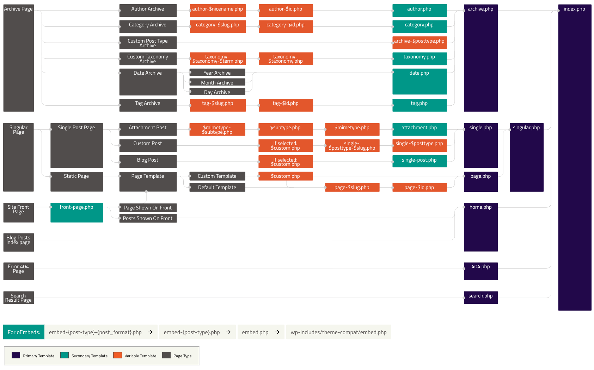
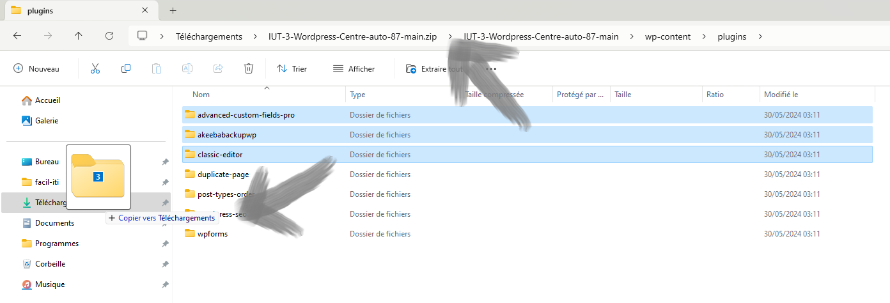
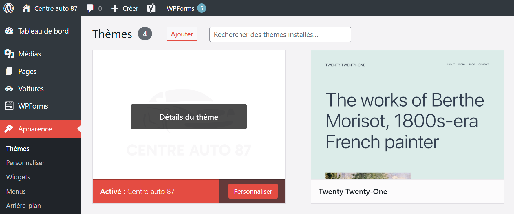
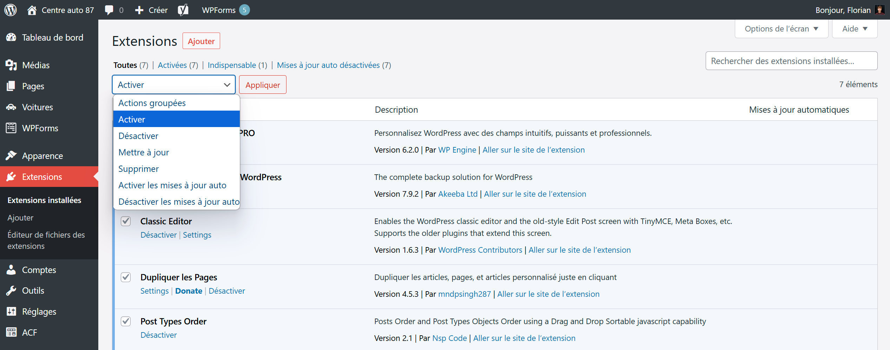
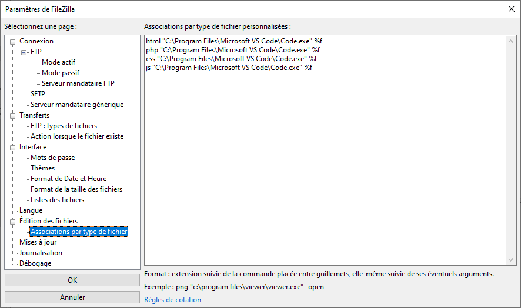
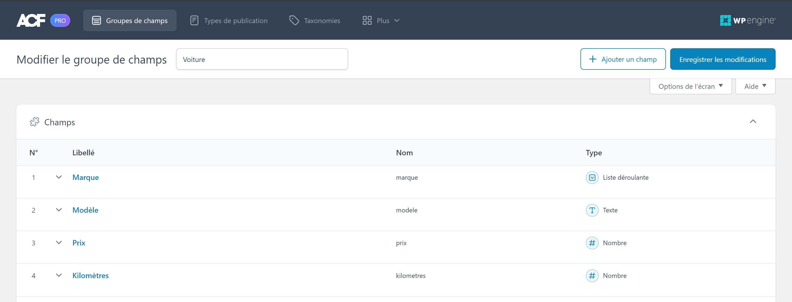
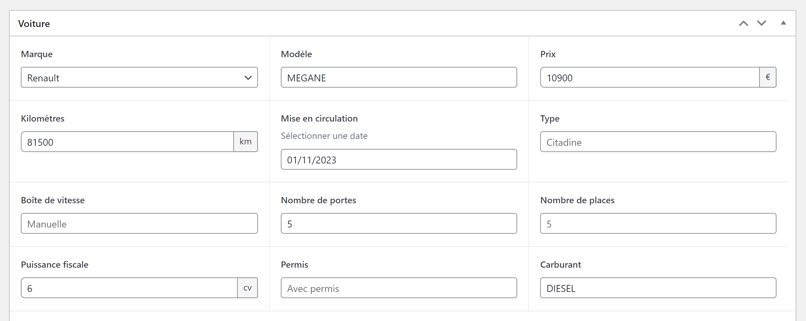
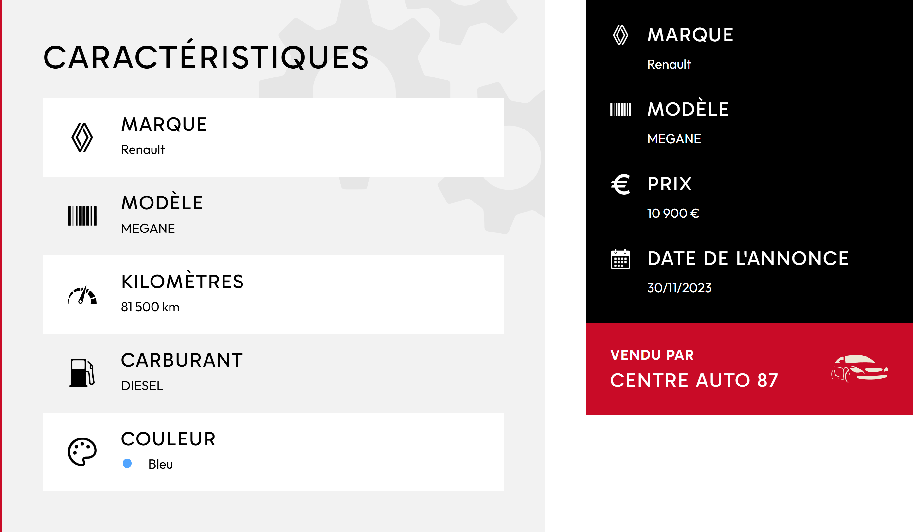

## 

**Date** : Mai 2026  
**Session** : MMI 1  
**Intervenant** : Florian Jourde  
**Contact** : [jourdeflorian@gmail.com](www.jourdeflorian@gmail.com)

---

## 

<ol>
  <li><a href="#1-objectif">Objectif du TD</a>
    <ol>
      <li>Initiation à WordPress</li>
    </ol>
  </li>
  <li><a href="#2-installation">Installation de WordPress avec Wamp</a>
    <ol>
      <li>Installation de WordPress</li>
    </ol>
  </li>
  <li><a href="#3-content-management">Gestion de contenus</a>
    <ol>
      <li>Gestion du contenu simplifiée</li>
      <li>Hiérarchie des modèles</li>
    </ol>
  </li>
  <li><a href="#4-child-theme">Création de thèmes enfants</a>
    <ol>
      <li>Qu'est-ce qu'un thème enfant ?</li>
      <li>Initialisation des fichiers</li>
    </ol>
  </li>
  <li><a href="#5-page-creation">Création et personnalisation de pages</a>
    <ol>
      <li>Personnalisation des pages</li>
      <li>Modèles de pages personnalisés</li>
    </ol>
  </li>
  <li><a href="#6-acf">Configuration du plugin ACF</a>
    <ol>
      <li>À quoi sert ACF</li>
      <li>Configuration d'ACF</li>
      <li>Création de champs personnalisés</li>
    </ol>
  </li>
</ol>

---

<h2 id="1-objectif"> 


</h2>

### 

L'exercice de création d'un site via le CMS WordPress s'inscrit dans le cadre de la SAÉ 202. Voici le site pour lequel il vous a été de demander de réaliser la communication :

- https://www.rockenseine.com/

Dans la continuité des livrables et visuels déjà produits, l'objectif sera maintenant d'intégrer le site en s'épaulant des fonctionnalités fournies par WordPress.

<h2 id="2-installation"> 


</h2>

### 

1. Téléchargez la dernière version de WordPress depuis le site officiel : https://wordpress.org/download/
2. Extrayez le fichier ZIP dans le répertoire www de votre installation Wamp (habituellement C:\wamp64\www).
3. Renommez le dossier extrait en un nom facile à retenir pour votre site, par exemple "rockenseine".
4. Ouvrez votre navigateur et accédez à `rockenseine.localhost` pour commencer l'installation de WordPress.

Pour vous connecter à la base de données PhpMyAdmin, utilisez vos identifiants Unilim suivants :

- **nom de base de données**
- **nom d'utilisateur**
- **mot de passe**.

Pour faciliter la connexion au site, vous pouvez également utiliser ces mêmes identifiants pour la connexion au tableau de bord de WordPress. Étant uniquement disponibles en local, il ne représentent pas, ici, un enjeu de sécurité important.

*Notes : Sauvegardez bien votre base de données initiale avant mise en place d'un site WordPress afin de conserver une copie de vos tables personnelles !*

<h2 id="3-content-management"> 


</h2>

### 

WordPress offre une interface aboutie pour gérer le contenu du site, permettant aux utilisateurs techniques ou non de mettre à jour facilement le contenu des pages, des articles de blog et d'autres éléments.

Voici quelques exemples, essentiels à connaître quand on découvre WordPress.

```php
<?php 
/**
 * 1. LA BOUCLE WORDPRESS (The Loop)
 * Cœur de WordPress : parcourt et affiche les posts/pages
 */
if (have_posts()) :              // S'il y a du contenu à afficher
    while (have_posts()) :       // Tant qu'il reste des posts
        the_post();              // Prépare les données du post courant
        
        the_title('<h2>', '</h2>');  // Titre du post
        the_content();               // Contenu du post
        the_excerpt();               // Extrait/résumé
        the_post_thumbnail();        // Image mise en avant
        the_date();                  // Date de publication
        the_author();                // Auteur
        
    endwhile;
else :
    echo '<p>Aucun contenu trouvé.</p>';
endif;
?>
```

```php
<?php
/**
 * 2. REQUÊTE PERSONNALISÉE (WP_Query)
 * Récupérer des posts selon des critères spécifiques
 */
$args = [
    'post_type'      => 'voiture',      // Type de contenu (post, page, ou custom)
    'posts_per_page' => 6,              // Nombre de résultats
    'orderby'        => 'date',         // Tri par date
    'order'          => 'DESC',         // Du plus récent au plus ancien
    'meta_key'       => 'prix',         // Champ personnalisé
    'meta_value'     => 10000,          // Valeur à filtrer
    'meta_compare'   => '<=',           // Opérateur (<=, >=, =, LIKE...)
];

$query = new WP_Query($args);

if ($query->have_posts()) :
    while ($query->have_posts()) : $query->the_post();
        the_title();
        echo '<p>Prix : ' . get_field('prix') . ' €</p>';
    endwhile;
    wp_reset_postdata();  // Important : réinitialise la requête globale
endif;
?>
```

```php
<?php
/**
 * 3. STRUCTURE D'UN THÈME - functions.php
 * Configuration et fonctionnalités du thème
 */

// Activer les fonctionnalités du thème
function mon_theme_setup() {
    add_theme_support('title-tag');           // Balise <title> automatique
    add_theme_support('post-thumbnails');     // Images mises en avant
    add_theme_support('custom-logo');         // Logo personnalisable
    
    register_nav_menus(['primary' => 'Menu principal']);
}
add_action('after_setup_theme', 'mon_theme_setup');

// Charger CSS et JS proprement
function mon_theme_scripts() {
    wp_enqueue_style('main-css', get_stylesheet_uri());
    wp_enqueue_script('main-js', get_template_directory_uri() . '/js/main.js', [], '1.0', true);
}
add_action('wp_enqueue_scripts', 'mon_theme_scripts');
?>
```

### 

Il est important de comprendre que les thèmes WordPress sur un système de "fallback" de page : de gauche à droite, la page affichée si la précédente n'est pas trouvée par le système.

Ci-après, vous trouverez un schéma permettant de visualiser comment fonctionne ce système.



Vous retrouverez ce schéma, ainsi que des informations annexes, sur cette page : https://developer.wordpress.org/themes/basics/template-hierarchy/.


<h2 id="4-child-theme"> 


</h2>

### 

WordPress offre de nombreuses fonctionnalités intégrées telles que la gestion des utilisateurs, la gestion des commentaires, la gestion des médias, etc., ce qui réduit le besoin de développement personnalisé pour ces fonctionnalités de base.

Un thème enfant est un thème WordPress qui hérite des fonctionnalités et du style d'un autre thème parent, appelé le thème parent. Cela permet de personnaliser et d'étendre les fonctionnalités d'un thème parent sans modifier directement ses fichiers.

Il est important d'utiliser un thème enfant pour plusieurs raisons : cela facilite la maintenance en isolant les modifications du thème parent, cela offre une meilleure sécurité en préservant les personnalisations lors des mises à jour, et cela respecte les bonnes pratiques de développement WordPress.

### 

1. Téléchargez l'archive depuis le dépôt GitHub suivant : https://github.com/FlorianJourde/IUT-3-WordPress-Centre-auto-87/

2. Accédez au répertoire `wp-content/themes/` de votre installation WordPress.

2. Glissez-y les dossiers `twentytwentyone` et `twentytwentyone-child`, depuis l'archive précédemment téléchargée.

*Notes : La décompression d'une archive étant une action parfois chronophage, il est possible de n'extraire que les dossiers dont nous avons besoin. Pour réaliser une extraction partielle, il suffit de glisser-déposer seulement les dossiers dont nous avons besoin dans le cadre de notre travail.*



3. Dans le répertoire `wp-content/plugins/`, supprimer les plugins par défaut (Akismet, Hello Dolly..) qui sont de simples "Hello world".

4. Toujours depuis le dépôt [IUT-3-WordPress-Centre-auto-87](https://github.com/FlorianJourde/IUT-3-WordPress-Centre-auto-87), glissez dans vos fichiers locaux les dossiers contenus dans le dossier `wp-content/plugins/`. Étant donné le nombre de fichiers qui composent les plugins WordPress, cela peut prendre un certain temps.

5. Pour activer le thème enfant, accédez à l'administration WordPress de votre site. Allez dans l'onglet "Apparence" puis "**Thèmes**". Vous devriez voir votre thème enfant répertorié. Activez-le en cliquant sur le bouton "Activer".



6. Activez également les plugins en accédant à "**Extensions**" depuis l'administration WordPress de votre site. Activez ensuite la case à cocher pour sélectionner toutes les extensions, dans la liste déroulante, choisissez "Activer", enfin, cliquez sur "Appliquer" pour activer toutes les extensions d'un coup.



7. À partir d'ici, vous êtes en capacité d'ajuster les fichiers CSS, HTML, JavaScript ou PHP qui vous intéressent pour réaliser l'intégration de votre propre site web. Il vous est donc possible d'intégrer la maquette que vous avez préconçue en adaptant les fichiers CSS

*Notes : Pour optimiser l'édition des fichiers via FileZilla ou WinSCP, il est possible de modifier les réglages d'associations personnalisés en ajoutant ces lignes dans les paramètres :*

- *FileZilla > Paramètres > Edition des fichiers > Association par type de fichiers*

```
css "C:\Program Files\Microsoft VS Code\Code.exe" %f
php "C:\Program Files\Microsoft VS Code\Code.exe" %f
html "C:\Program Files\Microsoft VS Code\Code.exe" %f
js "C:\Program Files\Microsoft VS Code\Code.exe" %f
```



<h2 id="5-page-creation"> 


</h2>

### 

L'utilisation de l'extension **"Classic Editor"** est requise pour la réalisation de cet exercice.

Cet éditeur est progressivement remplacé par l'éditeur **"Gutenberg"** depuis 2020, mais l'utilisation de l'éditeur initial de WordPress permet de bien cerner la plus value de l'utilisation des "champs personnalisés" (ACF), dans le cas ou un client non-technique à la main sur le site final : vous vous chargez de la structure, le client alimente le contenu.

L'éditeur Gutenberg laisse plus de liberté quant à la mise en page du site, ce qui peut être souhaitable ou non selon les appétences en développement du futur modérateur.

### 

Les modèles de page personnalisés sont des fichiers permettant de définir des mises en page uniques pour certaines pages. Ils complètent la hiérarchie standard de WordPress :

- `single.php` pour un article ;
- `archive.php` pour les listes.

Ils offrent un contrôle total sur des pages spécifiques : page d'accueil sur mesure, portfolio, page contact avec formulaire, landing pages marketing, etc.

```php
<?php
/**
 * Template pour afficher un article individuel (single post)
 * Fichier : single.php dans un thème enfant WordPress
 */

get_header();
?>

<section class="single-container">
    <div class="wrapper">

        <!-- 1. AFFICHAGE CONDITIONNEL D'IMAGES -->
        <?php if (get_field('images')) : // Champ ACF (Advanced Custom Fields) ?>
            <div class="swiper">
                <?php foreach (get_field('images') as $image) : ?>
                    <div class="swiper-slide">
                        " alt="">
                    </div>
                <?php endforeach; ?>
            </div>
        <?php else : ?>
            <!-- Image par défaut si pas de galerie -->
            <?php 
            $thumbnail = get_the_post_thumbnail_url(get_the_ID()) 
                ?: get_home_url() . '/wp-content/themes/mon-theme/default.png';
            ?>
            " alt="">
        <?php endif; ?>

        <!-- 2. AFFICHAGE DE CHAMPS PERSONNALISÉS (ACF) -->
        <div class="description">
            <h2>Description</h2>
            <p><?= get_field('description'); ?></p>
        </div>

        <!-- 3. AFFICHAGE CONDITIONNEL D'UN CHAMP -->
        <?php if (get_field('prix')) : ?>
            <div class="row">
                <h3>Prix</h3>
                <p><?= number_format(get_field('prix'), 0, ".", " "); ?> €</p>
            </div>
        <?php endif; ?>

        <!-- 4. FONCTIONS WORDPRESS NATIVES -->
        <div class="infos">
            <p>Date : <?= get_the_date(); ?></p>
            <p>Vendeur : <?= get_bloginfo('name'); ?></p>
            
            <!-- Logo du site -->
            " alt="Logo">
        </div>

        <!-- 5. TRANSFORMATION DE TEXTE -->
        <?php
        $accents = ['é' => 'e', 'è' => 'e', 'ê' => 'e', 'à' => 'a', 'ù' => 'u'];
        $marque = strtr(get_field('marque'), $accents);
        $logo_url = get_home_url() . '/assets/brands/' . strtolower($marque) . '-logo.png';
        ?>
        " alt="<?= get_field('marque'); ?>">

    </div>
</section>

<!-- 6. INCLUSION DE TEMPLATES PARTIELS -->
<?php get_template_part('template-parts/content/content-portfolio'); ?>
<?php include('template-parts/partials/action-section.php'); ?>

<?php get_footer();
```

Dans cet exemple, vous pouvez ensuite personnaliser la mise en page et le contenu de votre modèle comme vous le souhaitez entre les balises `get_header()` et `get_footer()`.

<h2 id="6-acf"> 


</h2>

### 

Le plugin Advanced Custom Fields (ACF) est un outil puissant qui permet d'ajouter facilement des champs personnalisés à vos pages, articles et autres types de contenus dans WordPress.

C'est un outil particulièrement adapté aux personnes à qui sont destinées la modération du site, sans pour autant avoir les compétences techniques.

### 

Une fois le plugin activé, vous pouvez accéder à ses paramètres en cliquant sur "Custom Fields" dans le menu de l'administration WordPress.

Là, vous pouvez configurer différentes options selon vos besoins, telles que les autorisations d'affichage des champs personnalisés et les paramètres de mise en cache.

### 

Voici un exemple de déclaration de champ personnalisé :

```php
<?php

add_action( 'init', 'custom_post_type', 0 );
function custom_post_type() {
    $labels = [
        'name'                => _x( 'Voitures', 'Post Type General Name'),
        'singular_name'       => _x( 'Voiture', 'Post Type Singular Name'),
        'menu_name'           => __( 'Voitures'),
        'all_items'           => __( 'Toutes les voitures'),
        'view_item'           => __( 'Voir les voitures'),
        'add_new_item'        => __( 'Ajouter une nouvelle voiture'),
        'add_new'             => __( 'Ajouter'),
        'edit_item'           => __( 'Editer la voiture'),
        'update_item'         => __( 'Modifier la voiture'),
        'search_items'        => __( 'Rechercher une voiture'),
        'not_found'           => __( 'Non trouvée'),
        'not_found_in_trash'  => __( 'Non trouvée dans la corbeille'),
    ];

    $args = [
        'label'               => __( 'Voitures'),
        'description'         => __( 'Tous sur voitures'),
        'labels'              => $labels,
        'menu_icon'           => 'dashicons-car',
        'supports'            => array( 'title', 'excerpt', 'author', 'thumbnail', 'comments', 'revisions', 'custom-fields', ),
        'show_in_rest'        => true,
        'hierarchical'        => false,
        'public'              => true,
        'has_archive'         => true,
        'rewrite'			  => array( 'slug' => 'voitures'),
    ];

    register_post_type( 'voitures', $args );
}

?>
```

Cette déclaration peut-être directement effectuée dans le fichier `functions.php`, mais peut également être déclarée dans un fichier dédié. Cette solution sera d'ailleurs privilégiée, à mesure que le site s’étoffe, que les champs personnalisées ou autres fonctionnalités se font plus nombreuses.





Et voici un exemple de rendu de ces mêmes champs en front, suite à un ajustement de la mise en page en CSS.



## 

### 
1. Intégrer le code du dépot suivant à votre site WordPress :
    - https://github.com/FlorianJourde/IUT-3-Wordpress-Centre-auto-87

2. **S'approprier les fichiers** et comprendre comment manipuler les **styles** (CSS) et **templates** (PHP).

3. Utiliser les fichiers `single.php` & `archive.php`, ainsi que le plugin ACF pour présenter les informations en lien avec le travail à réaliser pour la SAÉ, par exemple :
    - **Artiste** : image, description, genre, pays d'origine, label, heure de passage ;
    - **Scène** : image, description, nom, lieu...

    Les champs devront provenir du **tableau de bord** de votre site WordPress et être créés via le système de **pages** ainsi que les champs ACF.

*Notes : Si vous n'avez pas d'inspiration pour trouver des **données** à afficher, vous pouvez, par exemple, reprendre les infos sur le site actuel de [Rock en Seine](https://www.rockenseine.com/) ou bien aller chercher les [assets](https://github.com/FlorianJourde/IUT-2-Wordpress-TD/tree/main/assets) mis à disposition lors de la précédente version de ce cours. L'idée étant que vous prépariez au maximum le site pour y intégrer vos **propres médias**, une fois votre **maquette** établie.*

### 
1. Gérer les pages du menu via l'interface dédiée de WordPress :
    - **Tableau de bord** > **Apparence** > **Menus** > **Pages** > **Structure** du menu (dashboard)
    
    On peut retrouver les menus "consommés" aux emplacements suivants :
    - `.../wp-content/themes/twentytwentyone-child/template-parts/header` (fichiers)
    
    Au sein de ce fichier, le menu est déclaré au niveau de la ligne suivante :
    ```php
    <?php wp_nav_menu(); ?>
    ```

2. Sur une page de type `archive`, présenter les artistes présents au festival. Au clic sur un artiste, une page dédiée `single` doit présenter les informations liées à celui-ci.

3. Se familiariser avec l'ajout de champs personnalisés d'**ACF** (Advanced Custom Field). WordPress gère nativement le nom, l'image et la description, vous pouvez donc ajouter un ou plusieurs des champs suivants à un artise : **genre**, **pays d'origine**, **label**...

N'hésitez pas à prendre des **initiatives** au niveau du site : design, structure, pages... C'est l'appropriation du template de base pour y intégrer vos assets qui sera évalué.

Plus le site sera **personnel** et **cohérent** par rapport à l'objectif d'organisation d'un festival, meilleure sera l'appréciation !

*Notes : Comme pour l'objectif précédent, il est possible d'utiliser les artistes du site [Rock en Seine](https://www.rockenseine.com/), en attendant le contenu définitif.*